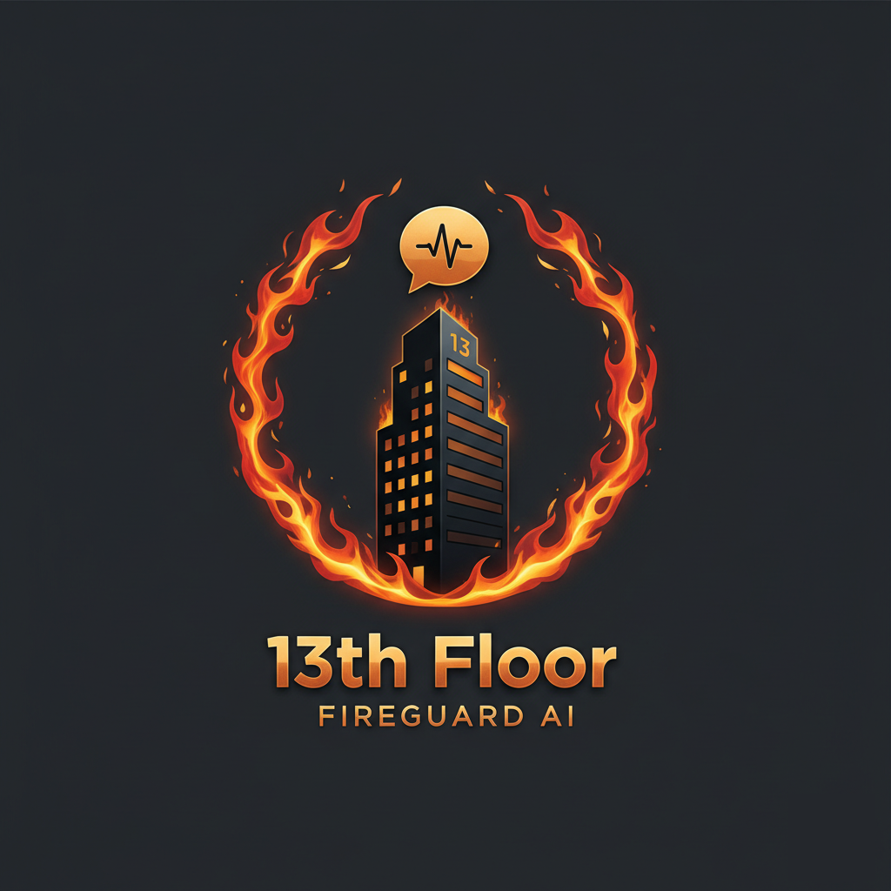

# 13th Floor - Fireguard.ai




**A Next-Generation Fire Safety for Resident Management Application**

_Project created by **Keon Jukes** for the Cerebral Valley Gemini Hackathon._

---

## 1. The Problem with Fire Alarms

Traditional fire alarm systems in apartment buildings are archaic. They are loud, impersonal, and often terrifying, causing panic rather than providing clear, actionable guidance. When a resident is trapped or disoriented, the blaring siren offers no help, no information, and no reassurance. There is a critical gap in communication during the most vital moments of an emergency.

## 2. The Solution: Fireguard.ai

**13th Floor** is a prototype application that redefines the resident experience during a fire emergency. It moves beyond the simple alarm and provides a comprehensive, intelligent, and interactive safety net for every resident. By leveraging the advanced multimodal and conversational capabilities of the Google Gemini API, Fireguard.ai turns a moment of panic into a guided, informed, and calmer evacuation process.

The core innovation is the **Gemini Live Distress Signal**, which transforms the terrifying experience of being trapped during a fire into a direct, real-time conversation with an AI emergency dispatcher who already knows who and where you are.

## 3. Key Features

-   **Resident Profile Management**: Securely store essential information like apartment number, floor, number of tenants, and emergency contacts.
-   **AI-Powered Fire Monitoring**: (Powered by **Gemini 2.5 Flash**) Users can upload security camera footage, and the AI will analyze it frame-by-frame, logging any signs of fire or smoke and triggering an alert.
-   **Personalized 3D Evacuation Routes**: When a fire is detected, the app generates a dynamic 3D visualization of the building, showing the fire's location, the resident's location, and a clear, safe path to the nearest exit.
-   **Live Emergency Responder Tracking**: A mock interface shows the real-time location and ETA of dispatched fire department units, reducing uncertainty.
-   **Voice-Controlled Navigation**: Hands-free control allows users to navigate through the app's different sections using simple voice commands.
-   **Fire Safety Guidelines**: A dedicated section provides residents with essential fire safety tips and procedures.

## 4. The Gemini Live API: A New Fire Alarm Experience

The cornerstone of the application is the **Distress Signal** page, which utilizes the **Gemini 2.5 Flash Native Audio (Live API)** to create a new paradigm for emergency communication.

### How It Works:

When a resident feels trapped or needs immediate assistance, they can activate the "Distress Signal". Instead of just a siren, this initiates a live, two-way audio and text conversation with a Gemini-powered AI dispatcher.

1.  **Instant, Proactive Contact**: The moment the session starts, Gemini speaks first. It doesn't wait for the panicked user to talk. It immediately provides reassurance and confirms their identity and location, using the data from their resident profile.
    > *"This is the emergency line. We've received your distress signal from apartment 4B on floor 4. Help is on the way. Can you tell me what's happening? Are you safe right now?"*

2.  **Real-Time, Conversational Support**: The resident can speak naturally, and their words are transcribed in real-time. Gemini listens and responds with a calm, guiding voice, providing instructions, keeping them on the line, and gathering critical information (e.g., "Is the smoke thick?", "Can you get low to the ground?").

3.  **Reduced Panic, Increased Safety**: This human-like interaction is designed to be calming. It provides a focal point for the resident, helping them manage their fear while the AI relays simulated updates and gathers information that could be vital for first responders.

4.  **Accessibility**: For residents who cannot speak, the system is fully integrated with a text chat, allowing them to type their messages and receive spoken audio responses from the dispatcher.

This feature transforms the fire alarm from a loud, impersonal warning into a personal, intelligent, and life-saving conversation.

## 5. Technology Stack

-   **Frontend**: React 19, TypeScript
-   **Styling**: Tailwind CSS
-   **3D Visualization**: Three.js
-   **AI & Core Logic**:
    -   **Google Gemini 2.5 Flash (Vision)**: For the fire monitoring video analysis.
    -   **Google Gemini 2.5 Flash Native Audio (Live API)**: For the real-time AI dispatcher in the Distress Signal feature.
-  **Backend**: Oracle Cloud Infrastructure MySQL Heatwave DB
  
## 6. Database

I used Oracle CLoud Infrastructure mySQL Heatwave DB for this project to persist data. To avoid going over the free tier, I have not connected it to the live deployment, but I will provide the schema if you want to try it out. Below is the table schema

residents Table Schema

```sql
CREATE TABLE residents (
    id INT AUTO_INCREMENT PRIMARY KEY,
    name VARCHAR(255) NOT NULL,
    apt_number VARCHAR(50) NOT NULL,
    floor INT NOT NULL,
    phone VARCHAR(20) NOT NULL,
    tenants INT NOT NULL,
    photo LONGTEXT, -- To store the Base64 encoded image string
    emergency_contact_name VARCHAR(255),
    emergency_contact_phone VARCHAR(20),
    created_at TIMESTAMP DEFAULT CURRENT_TIMESTAMP,
    updated_at TIMESTAMP DEFAULT CURRENT_TIMESTAMP ON UPDATE CURRENT_TIMESTAMP,
    UNIQUE KEY unique_apt_floor (apt_number, floor) -- Optional: To prevent duplicate apartment entries
);
```

Explanation of Columns:

- id: A unique, auto-incrementing integer that serves as the primary key for the table.
- name: Stores the resident's full name. VARCHAR(255) is a standard choice for names.
- apt_number: Stores the apartment number. VARCHAR(50) is used because apartment numbers can be alphanumeric (e.g., "4B", "PH-1").
- floor: An integer to store the floor number.
- phone: Stores the resident's phone number. VARCHAR(20) is flexible enough for formatted numbers like (555) 123-4567.
- tenants: An integer for the number of tenants.
- photo: LONGTEXT is used here to accommodate the very long Base64 string that represents the uploaded image. For production applications, you might consider storing the image in a dedicated file storage service (like Google Cloud Storage or Amazon S3) and only saving the URL here, but LONGTEXT works well for this prototype.
- emergency_contact_name / emergency_contact_phone: These fields are optional and can be NULL if the resident doesn't provide them.
- created_at / updated_at: Timestamps that automatically track when a record is created and last modified. This is very useful for auditing and data management.
- UNIQUE KEY (Optional): I've added an optional unique key constraint on apt_number and floor combined. This would prevent more than one registration for the same apartment, which might be a desirable business rule.

You can run this SQL command in your MySQL database to create the table. Read Oracle and MySQL documentation if you run into issues

## 7. Deployed

Here is the link to the deployed application: https://service-13th-floor-fireguard-ai-805507396207.us-west1.run.app/
